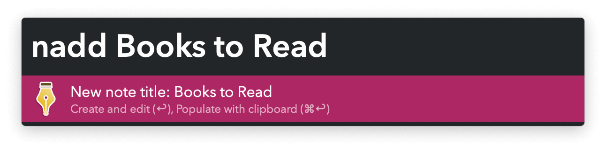
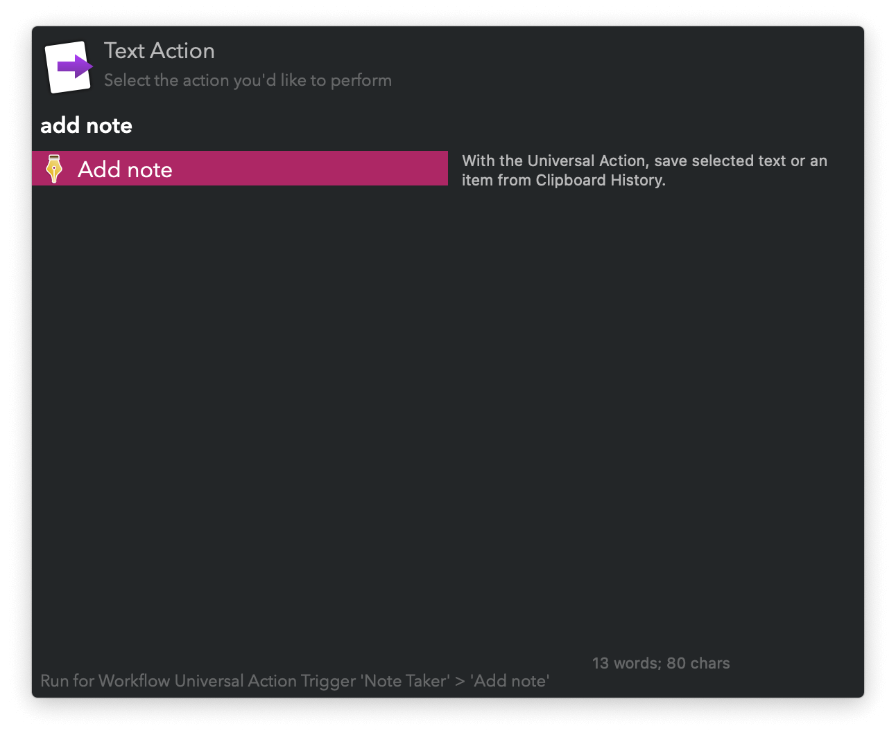
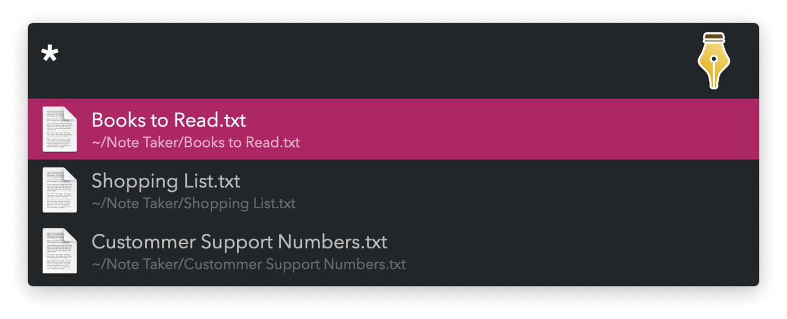

#  Note Taker Alfred Workflow

Keep small bits of text

<a href='https://alfred.app/workflows/vitor/note-taker'>⤓ Install From the Alfred Gallery</a>

## Usage

Create new notes via the Add Note Keyword (default: `nadd`). Type a name and press <kbd>⏎</kbd> to open the file for editing. Use <kbd>⌘</kbd><kbd>⏎</kbd> to save a file with the clipboard contents.

With the [Universal Action](https://www.alfredapp.com/help/features/universal-actions/), save selected text or an item from [Clipboard History](https://www.alfredapp.com/help/features/clipboard/).

Search your notes with the View Notes Keyword (default: `nview`).

* <kbd>⏎</kbd>: Open in your text editor.
* <kbd>⌥</kbd><kbd>⏎</kbd>: Copy contents.
* <kbd>⌘</kbd><kbd>⏎</kbd>: Copy contents and delete note.
* <kbd>⌘</kbd><kbd>Y</kbd> (or tap <kbd>⇧</kbd>): Quick Look the file.
