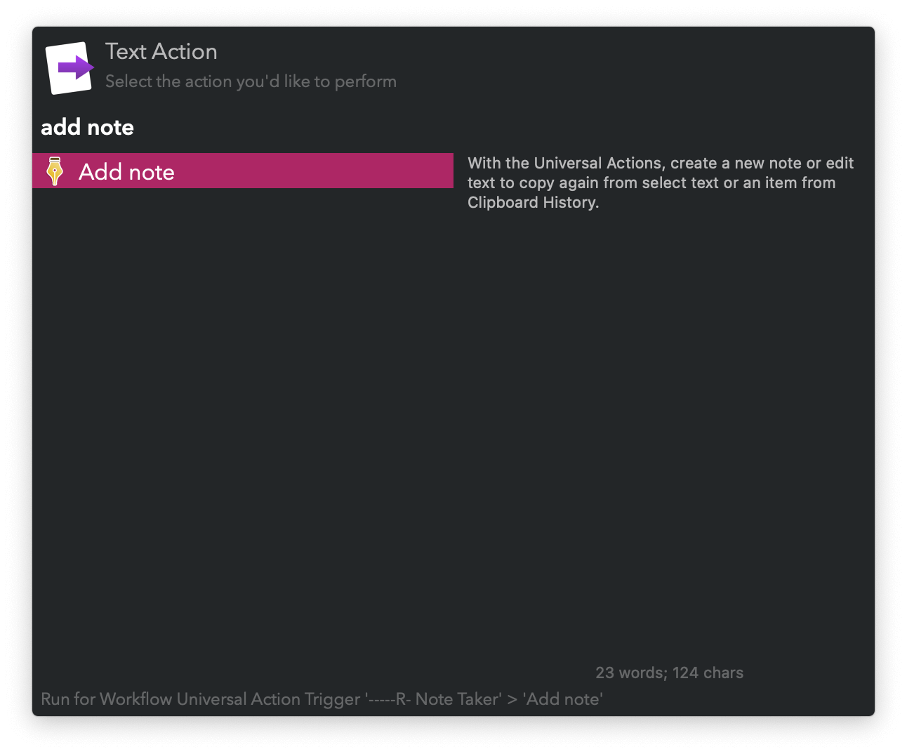
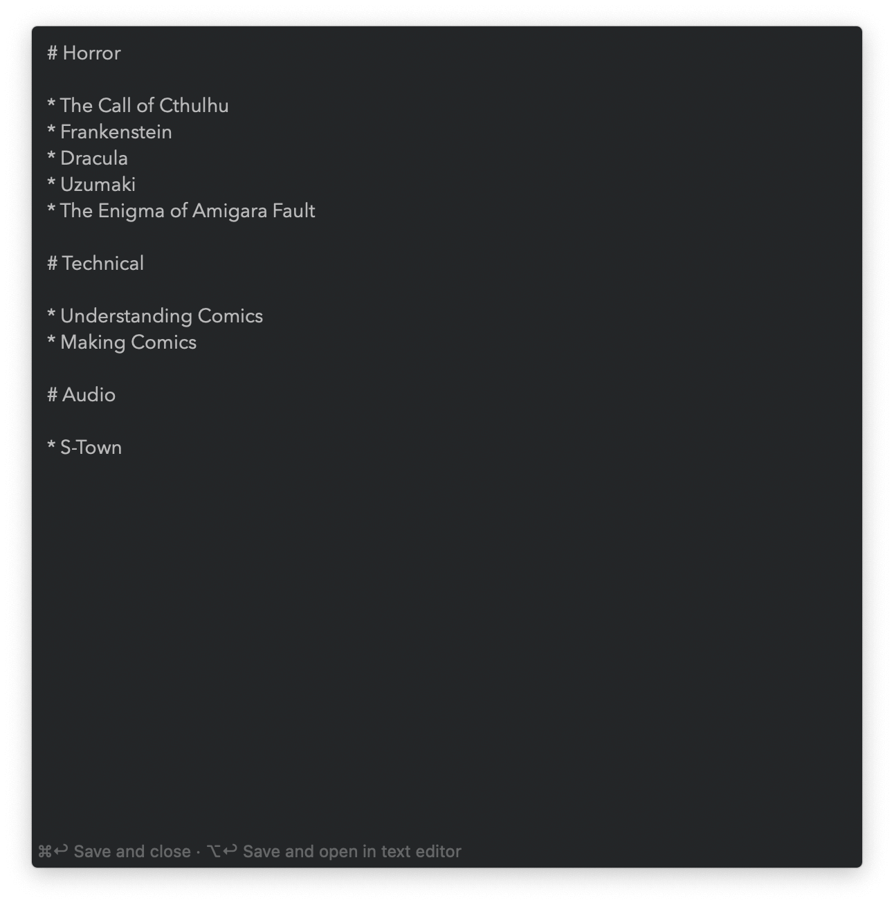
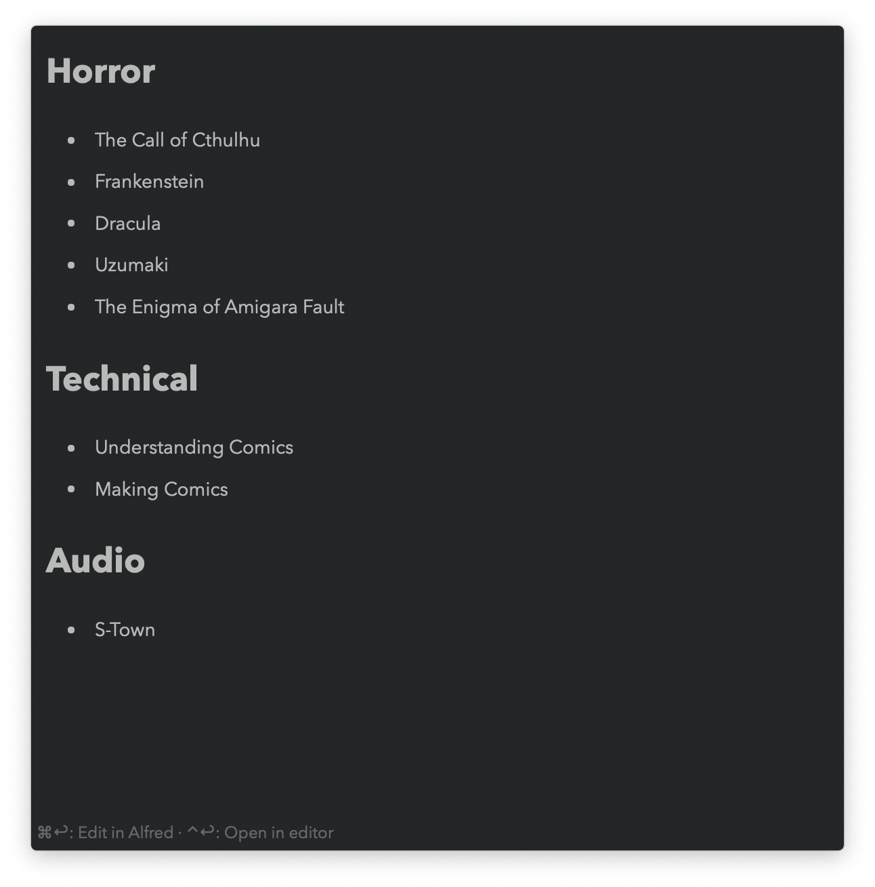

#  Note Taker Alfred Workflow

Keep small bits of text

[⤓ Install on the Alfred Gallery](https://alfred.app/workflows/vitor/note-taker)

## Usage

### Create

Make new notes via the `nadd` keyword. Type a name and press <kbd>↩&#xFE0E;</kbd> to open the file for editing.

Alternatively, create a new note from a selection or [Clipboard History](https://www.alfredapp.com/help/features/clipboard/) with the [Universal Action](https://www.alfredapp.com/help/features/universal-actions/).

### Search

Find your notes with the `nview` keyword.

* <kbd>↩&#xFE0E;</kbd> Edit note.
* <kbd>⌘</kbd><kbd>↩&#xFE0E;</kbd> Preview note in Alfred, parsing markdown.
* <kbd>⌥</kbd><kbd>↩&#xFE0E;</kbd> Copy note contents.
* <kbd>⌃</kbd><kbd>↩&#xFE0E;</kbd> Copy note contents and delete it.
* <kbd>⌘</kbd><kbd>Y</kbd> (or tap <kbd>⇧</kbd>) Quick Look note.

## Edit

Notes can be edited directly in Alfred or a text editor. The default can be changed in the [Workflow’s Configuration](https://www.alfredapp.com/help/workflows/user-configuration/). Alfred’s view is stacked, meaning <kbd>⎋</kbd> goes back to the search. <kbd>⌘</kbd><kbd>⎋</kbd> force hides.

* <kbd>⌘</kbd><kbd>↩&#xFE0E;</kbd> Save note.
* <kbd>⌥</kbd><kbd>↩&#xFE0E;</kbd> Save and open in text editor.

With the Universal Actions, edit text from a file, a selection, or [Clipboard History](https://www.alfredapp.com/help/features/clipboard/).

### Preview

Notes previewed in Alfred are parsed as markdown. The view is stacked, meaning <kbd>⎋</kbd> goes back to the search. <kbd>⌘</kbd><kbd>⎋</kbd> force hides.

* <kbd>⌘</kbd><kbd>↩&#xFE0E;</kbd> Edit note in Alfred.
* <kbd>⌥</kbd><kbd>↩&#xFE0E;</kbd> Open in text editor.
